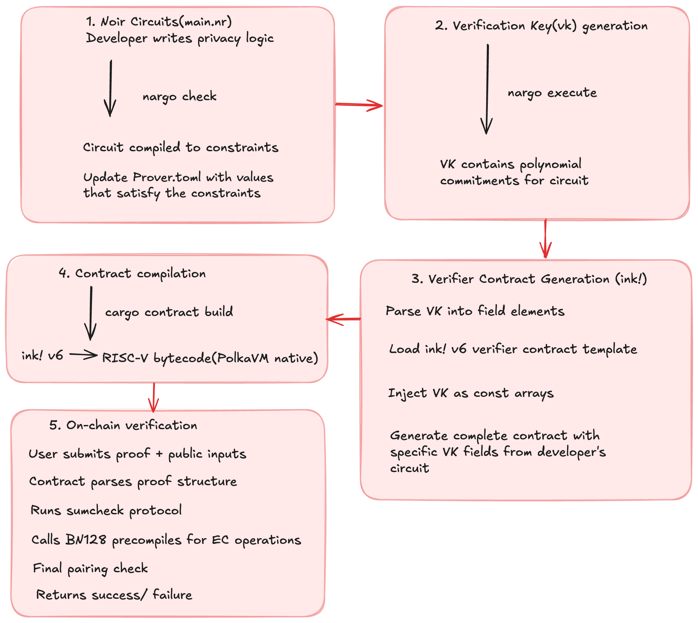

# IVF - Ink! Verifier Factory for Noir Circuits

> Automated generation of ink! v6 smart contract verifiers from Noir zero-knowledge proof circuits for PolkaVM.

## Overview

ink! Verifier Factory(iVF) bridges the gap between Noir's zero-knowledge proof circuits and Polkadot's ink! and PolkaVM, enabling developers to deploy privacy-preserving applications on any Polkadot parachain without external dependencies or bridges.

### Key Features

- **One-Command Generation**: Transform Noir VK files into production-ready ink! contracts
- **Native PolkaVM Integration**: Uses Pallet-Revive's BN128 precompiles for optimal performance
- **Circuit Agnostic**: Handles circuits of any complexity (tested from 57 to 128 field elements)
- **Gas Optimized**: Efficient field arithmetic and minimal storage footprint
- **Type-Safe**: Comprehensive error handling with detailed diagnostics
- **Zero External Dependencies**: Fully self-contained verification on-chain

